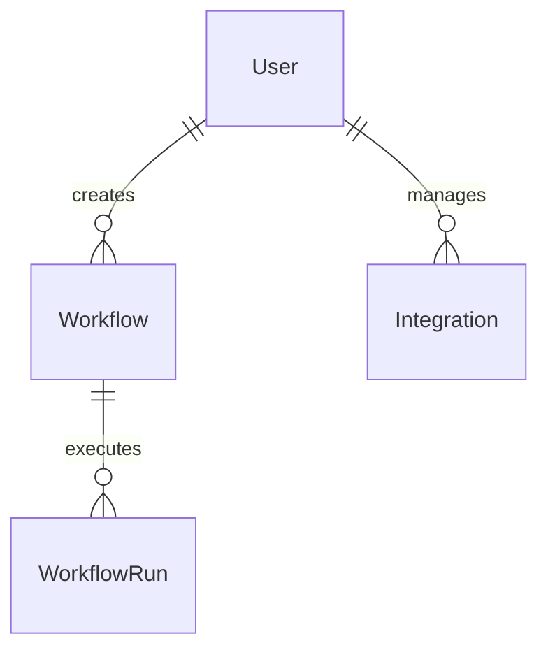

# Database Design

## 1. Database Design Summary:
This document outlines the relational database schema for the initial prototype of the natural language workflow creation tool, focusing on a **SQLite database with SQLModel** for the Python/FastAPI backend. The design prioritizes simplicity and clarity for the prototype while considering the core data requirements identified in the PRD and Architecture Guide. A secondary schema in Prisma format is provided for potential future migration to a Node.js backend.

## 2. Key Entities and Relationships:
*   **User:** Represents a user of the application. Stores authentication credentials and basic user information.
*   **Workflow:** Represents a single automated workflow created by a user. Stores the natural language description, the structured definition (trigger, actions, conditions), and metadata like creation date and last modified date. A User can have multiple Workflows (One-to-Many relationship: User to Workflow).
*   **Integration:** Represents a connection to an external service via an MCP server. Stores information about the MCP server and its configuration relevant to the user. A User can have multiple Integrations (One-to-Many relationship: User to Integration).
*   **WorkflowRun:** Logs each instance a workflow is executed. Stores a reference to the executed workflow, the trigger event data, execution status, timestamps, and any relevant output or error information. A Workflow can have many WorkflowRuns (One-to-Many relationship: Workflow to WorkflowRun).

## 3. ER Diagram



## 4. SQLModel Schema (Python/SQLite):

```python
from typing import List, Optional
from sqlmodel import Field, SQLModel, Relationship
from datetime import datetime

class User(SQLModel, table=True):
    id: Optional[int] = Field(default=None, primary_key=True)
    username: str = Field(unique=True, index=True)
    hashed_password: str
    email: Optional[str] = Field(default=None, unique=True, index=True)
    created_at: datetime = Field(default_factory=datetime.utcnow)

    workflows: List["Workflow"] = Relationship(back_populates="owner")
    integrations: List["Integration"] = Relationship(back_populates="owner")

class Workflow(SQLModel, table=True):
    id: Optional[int] = Field(default=None, primary_key=True)
    name: str
    description: Optional[str] = Field(default=None)
    natural_language_description: str
    structured_definition: dict # Store as JSON
    created_at: datetime = Field(default_factory=datetime.utcnow)
    updated_at: datetime = Field(default_factory=datetime.utcnow)

    owner_id: int = Field(foreign_key="user.id")
    owner: User = Relationship(back_populates="workflows")

    runs: List["WorkflowRun"] = Relationship(back_populates="workflow")

class Integration(SQLModel, table=True):
    id: Optional[int] = Field(default=None, primary_key=True)
    server_name: str # e.g., "github.com/Garoth/echo-mcp"
    config: dict # Store as JSON, specific to the MCP server
    created_at: datetime = Field(default_factory=datetime.utcnow)

    owner_id: int = Field(foreign_key="user.id")
    owner: User = Relationship(back_populates="integrations")

class WorkflowRun(SQLModel, table=True):
    id: Optional[int] = Field(default=None, primary_key=True)
    triggered_at: datetime = Field(default_factory=datetime.utcnow)
    status: str # e.g., "completed", "failed", "running"
    trigger_data: Optional[dict] = Field(default=None) # Store as JSON
    output_data: Optional[dict] = Field(default=None) # Store as JSON
    error_message: Optional[str] = Field(default=None)

    workflow_id: int = Field(foreign_key="workflow.id")
    workflow: Workflow = Relationship(back_populates="runs")
```

## 5. Prisma Schema (Node.js - Secondary):

```prisma
generator client {
  provider = "prisma-client-js"
}

datasource db {
  provider = "sqlite" // Or other database for production
  url      = env("DATABASE_URL")
}

model User {
  id            Int          @id @default(autoincrement())
  username      String       @unique
  hashedPassword String
  email         String?      @unique
  createdAt     DateTime     @default(now())

  workflows     Workflow[]
  integrations  Integration[]
}

model Workflow {
  id                        Int          @id @default(autoincrement())
  name                      String
  description               String?
  naturalLanguageDescription String
  structuredDefinition      Json // Use Json type for structured data
  createdAt                 DateTime     @default(now())
  updatedAt                 DateTime     @updatedAt

  ownerId                   Int
  owner                     User         @relation(fields: [ownerId], references: [id])

  runs                      WorkflowRun[]
}

model Integration {
  id            Int          @id @default(autoincrement())
  serverName    String
  config        Json // Use Json type for configuration
  createdAt     DateTime     @default(now())

  ownerId       Int
  owner         User         @relation(fields: [ownerId], references: [id])
}

model WorkflowRun {
  id            Int          @id @default(autoincrement())
  triggeredAt   DateTime     @default(now())
  status        String
  triggerData   Json?
  outputData    Json?
  errorMessage  String?

  workflowId    Int
  workflow      Workflow     @relation(fields: [workflowId], references: [id])
}
```

## 6. Design Rationale & Assumptions:**
*   **Initial Prototype Scope:** The schema is designed to support the core features described for the initial prototype. Complex features like detailed versioning of workflow *definitions* within the database are not included at this stage, relying on the `updated_at` timestamp and potentially external version control for the definition itself.
*   **SQLite Suitability:** SQLite is suitable for the prototype due to its file-based nature and ease of setup. Indexing is applied to frequently queried fields (`username`, `email`, foreign keys) to improve performance on SQLite.
*   **JSON Fields:** `structured_definition`, `config`, `trigger_data`, and `output_data` are stored as JSON. This provides flexibility for storing varied and evolving data structures associated with workflow steps, integration configurations, and run details without requiring frequent schema migrations in the early stages. SQLite supports JSON storage.
*   **SQLModel and Prisma Compatibility:** The core entity structure and relationships are designed to be compatible with both SQLModel and Prisma. Differences in field naming conventions (`hashed_password` vs `hashedPassword`) and type mapping (`dict` vs `Json`) are noted in the respective schema definitions.
*   **Future Scaling:** For future scaling beyond the prototype, migrating to a more robust database like PostgreSQL or MySQL would be necessary. The current schema provides a good starting point for such a migration. Considerations for multi-tenancy (e.g., adding an organization or tenant ID to relevant tables) would be addressed in a later design phase.
